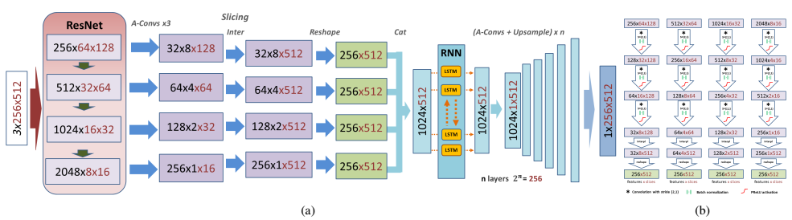

# SliceNet
Pytorch implementation of the CVPR 2021 oral paper: SliceNet: deep dense depth estimation from a single indoor panorama using a slice-based representation.

Paper at:
https://openaccess.thecvf.com/content/CVPR2021/papers/Pintore_SliceNet_Deep_Dense_Depth_Estimation_From_a_Single_Indoor_Panorama_CVPR_2021_paper.pdf


We present a novel deep neural network to estimate a depth map from a single monocular indoor panorama, called SliceNet.
The network directly works on the equirectangular projection, exploiting the properties of indoor 360 images.
Starting from the fact that gravity plays an important role in the design and construction of man-made indoor scenes, we propose a compact representation of the scene into vertical slices of the sphere, and we exploit long- and short-term relationships among slices to recover the equirectangular depth map. 
Our design makes it possible to maintain high-resolution information in the extracted features even with a deep network.
The experimental results demonstrate that our method outperforms current state-of-the-art solutions in prediction accuracy, particularly for real-world data.

This repo is a **python** implementation where you can test **depth inference** on an indoor equirectangular image.

**Method Pipeline overview**:


## Updates
* 2021-10-1: Inference script updated with valid mask and ground truth loader
* 2021-08-13: IMPORTANT: Fixed bug in weights init: model and pre-trained weights updated
	- REPLACE PREVIOUS MODEL AND WEIGHTS
* 2021-07-21: Network source code and demo released

## Requirements
- Python >=3.6
- pytorch>=1.0.1
- torchvision
- numpy
- PIL
- matplotlib.pyplot
- tqdm

## Pretrained weights.
Copy to your local ./ckpt directory.
- [resnet50_m3d.pth](https://vicserver.crs4.it/slicenet/resnet50_m3d.pth)
    - Trained with ResNet50 using Matterport3D dataset and their original training/testing splitting https://niessner.github.io/Matterport/. 
	- As in previous comparable works we resize the resolution of equirectangular image and depth map into 512 × 1024.
	- Stitching the original 18-poses format to equirectangular have been perfomed following the official procedure from https://github.com/niessner/Matterport/blob/master/data_organization.md, based on
	the methods/tools of Zhang https://github.com/yindaz/PanoBasic.
- [resnet50_stanford.pth]
	- Trained with ResNet50 using Stanford-2D-3D-S dataset http://buildingparser.stanford.edu/dataset.html. 
	- As in previous comparable works we adopt the official Fold#1 as split thus taking fifth area (area 5) for testing and the others for training.
	- As in previous comparable works we resize the resolution of equirectangular image and depth map into 512 × 1024. 
	- Invalid measures are masked as 0.
	- COMING SOON
- [resnet50_s3d.pth]
	- Trained with ResNet50 using Structured3D dataset and their official splitting.
	- COMING SOON
- [resnet50_360D.pth]
	- COMING SOON

NB. all depth values are encoded as [meters]. Measures over 16 meters or no reading are masked as 0 value.  

## Inference on equirectagular images	
Here an example of inferring using the pre-trained model on Matterport3D:
```
python inference.py --pth ckpt/resnet50_m3d.pth --img example/001ad2ad14234e06b2d996d71bb96fc4_color.png

```    
    - `--pth` path to the trained model.
    - `--img` path to the input equirectangular image.

NB. Inference time of this demo is higher than expected due to debug messages and result display
    
## Evaluation metrics
Evaluation metrics adopted for the paper results are provided in [eval.py] (eval.py). Metrics implementation is from https://github.com/XPFly1989/FCRN and https://github.com/meder411/OmniDepth-PyTorch .
We assume that the compared ground truth values are in meters and that the invalid pixels are masked as described in the paper and in the comparative work (i.e., range from 0 to 16 meters). 
Data loading and masking depends on your implementation and by the different data sources.

## Acknowledgement
- This work has received funding from Sardinian Regional Authorities under projects VIGECLAB, AMAC, and TDM (POR FESR 2014-2020). We also acknowledge the contribution of the European Union’s H2020 research and innovation programme under grant agreements 813170 (EVOCATION). The provided demo is released to complement the publication under the conditions of the mentioned projects, while the full source code remains the property of CRS4.

	
## Citation
Please cite our paper for any purpose of usage.
```
@InProceedings{Pintore:2021:SDD,
    author = {Giovanni Pintore and Marco Agus and Eva Almansa and Jens Schneider and Enrico Gobbetti},
    title = {{SliceNet}: deep dense depth estimation from a single indoor panorama using a slice-based representation},
    booktitle = {Proceedings of the IEEE/CVF Conference on Computer Vision and Pattern Recognition (CVPR)},
    month     = {June},
    year      = {2021},
    pages     = {11536-11545},
}
```


